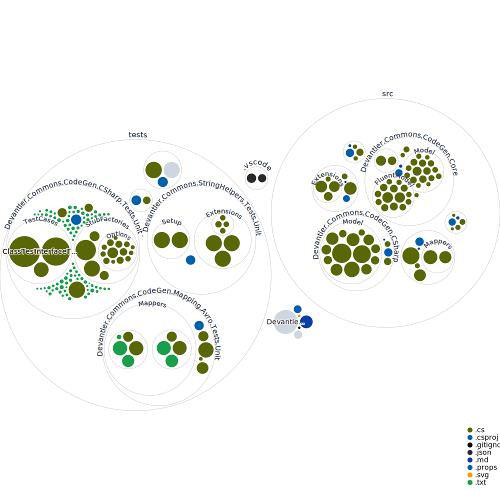

# .NET Commons 📦

[](https://codecov.io/gh/devantler/dotnet-commons)

This repository contains a collection of .NET libraries that can be used for everyday tasks in .NET applications.

<!-- readme-tree start -->
```
.
├── .github
│   └── workflows
├── .vscode
├── src
│   ├── Devantler.Commons.AutoFixture.DataAttributes
│   ├── Devantler.Commons.CodeGen.CSharp
│   │   └── Model
│   ├── Devantler.Commons.CodeGen.Core
│   │   ├── FluentModel
│   │   ├── Model
│   │   └── TemplateLoaders
│   ├── Devantler.Commons.CodeGen.Mapping.Avro
│   │   └── Mappers
│   ├── Devantler.Commons.CodeGen.Mapping.Core
│   └── Devantler.Commons.StringHelpers
│       └── Extensions
└── tests
    ├── Devantler.Commons.AutoFixture.DataAttributes.Tests.Unit
    ├── Devantler.Commons.CodeGen.CSharp.Tests.Unit
    │   ├── Model
    │   ├── StubFactories
    │   │   └── Options
    │   └── TestCases
    ├── Devantler.Commons.CodeGen.Core.Tests.Unit
    │   └── templates
    ├── Devantler.Commons.CodeGen.Mapping.Avro.Tests.Unit
    │   └── Mappers
    │       ├── AvroEntitiesCompilationMapperTests
    │       └── AvroModelsCompilationMapperTests
    └── Devantler.Commons.StringHelpers.Tests.Unit
        ├── Extensions
        │   ├── CasingStringExtensionsTests
        │   ├── FormattingStringExtensionsTests
        │   ├── GeneralStringExtensionsTests
        │   └── GrammarStringExtensionsTests
        └── Setup
            ├── AutoDataAttributes
            └── SpecimenBuilders

38 directories
```
<!-- readme-tree end -->

<details>
  <summary>Show/Hide codebase visualization</summary>



</details>

## Libraries

- Devantler.Commons.StringHelpers - A collection of classes, extensions, and methods for working with strings.
- Devantler.Commons.CodeGen.* - A set of code generators to generate code to, e.g. C#. It also packs a set of mappers to map different file formats to the compilation model used by the generators.
- Devantler.Commons.AutoFixture.DataAttributes - A set of data attributes for AutoFixture and NSubstitute to support common use cases.
